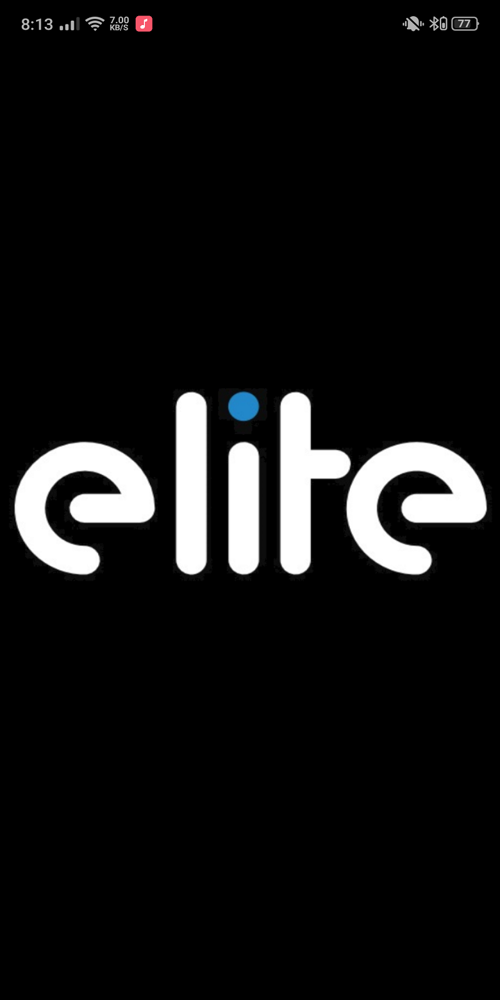
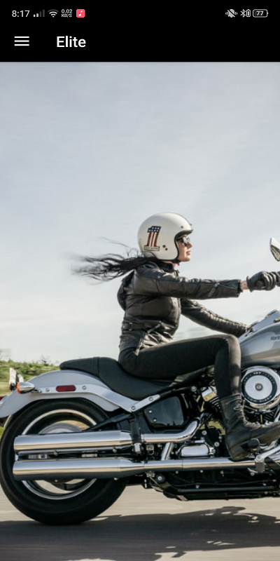
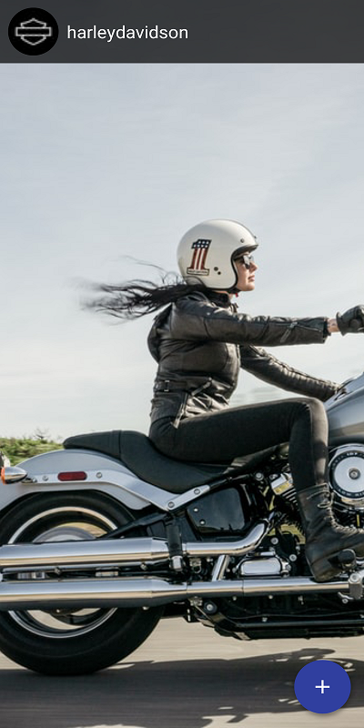
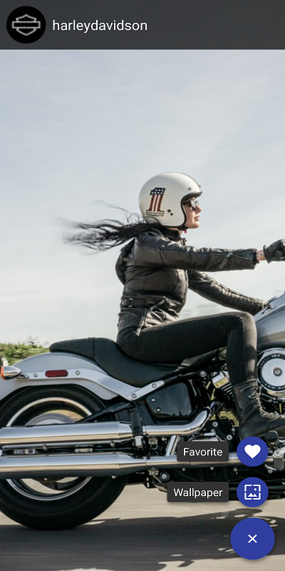
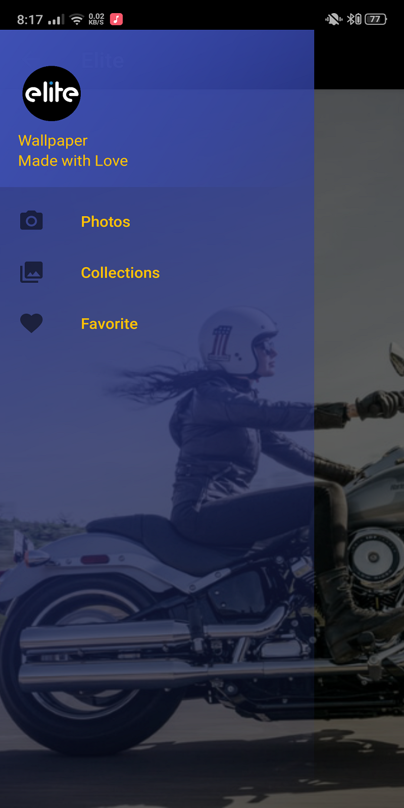
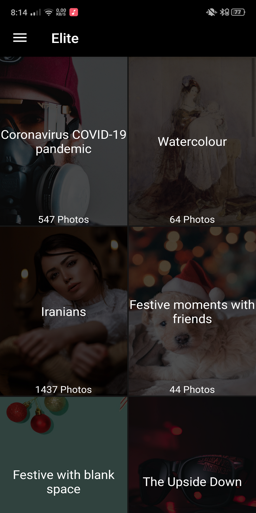
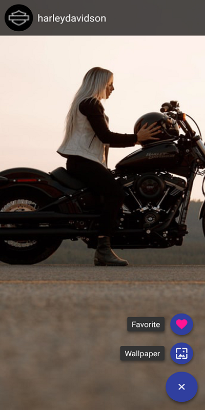
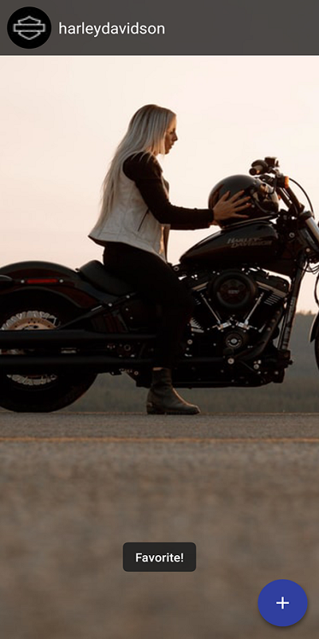

# Elite Wallpaper 
This App is Using REST-API

# Tools
I Used Some Libraries and Unsplash API
1. Retrofit
2. Log for Retrofit
3. Okhttp
4. Gson
5. Glide 4
6. ButterKnife
7. Realm
8. Circle ImageView
9. Floating Action Bar 

# Features
- You Can Put Wallpaper By Clicking On "Wallpaper" , It will Directly Set On Your Phone
- You Can Save Any Photos You Like By Clicking On "Favorite" , It Will Directly Store In Your Favorite Category

# Screenshots 
There are Some ScreenShots to Show How My App Look 

